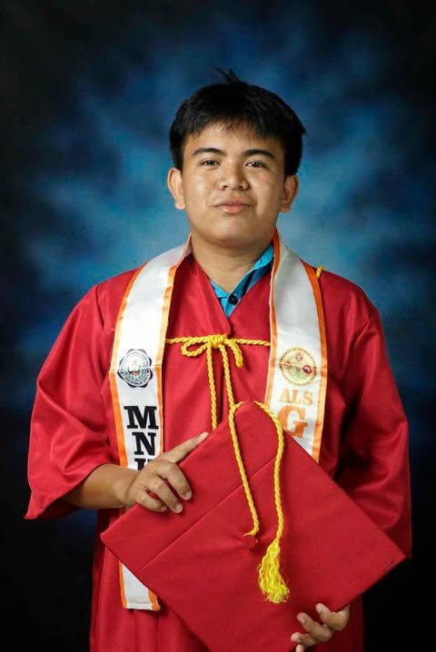

# 👋 Welcome to My E-Portfolio

## 👤 About Me
Hi! I am **[Zander B. Mondia]**, a student from San Isidro College taking up **BSIT**.  
I am passionate about technology, creativity, and continuous learning.

---

## 🎓 Education
- San Isidro College  
- Course: BSIT  
- Year Level: [FIRST YEAR]

---

## 💻 Skills
- HTML, CSS, JavaScript  
- Basic Programming  
- Problem Solving  
- Teamwork & Communication  

---

## 🎯 Hobbies & Interests
- Playing online games 🎮  
- Watching movies 🎬  
- Exploring technology 💻  
- Listening to music 🎧  

---

## 🖼️ Portfolio Profile
<button onclick="pic.style.display='block'"></button>
---

## 📬 Contact & Links
- Email: mondiaz@sic.edu.ph  
- GitHub: https://github.com/mondiaz-hub/E-Portfolio-Zander-B.-Mondia
- Facebook: https://www.facebook.com/zander.mondia.58 

---

## 📌 Notes
This portfolio is continuously updated as part of my learning journey.
